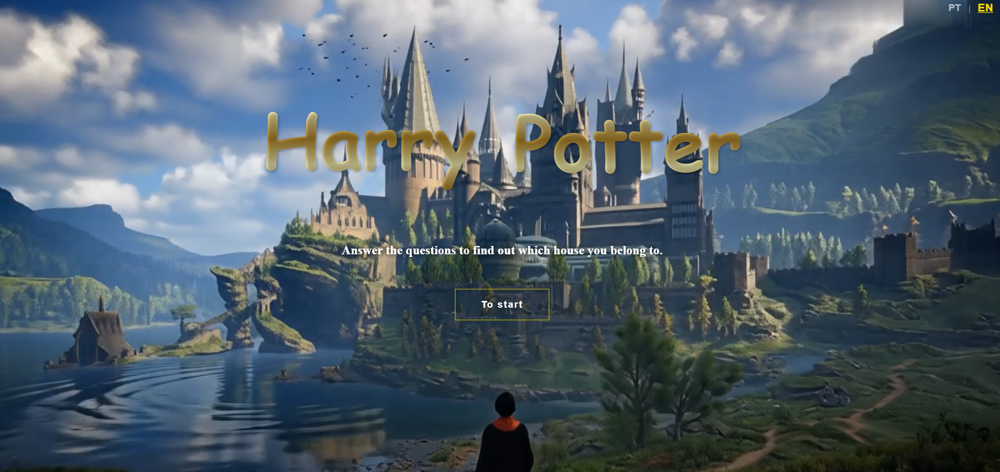
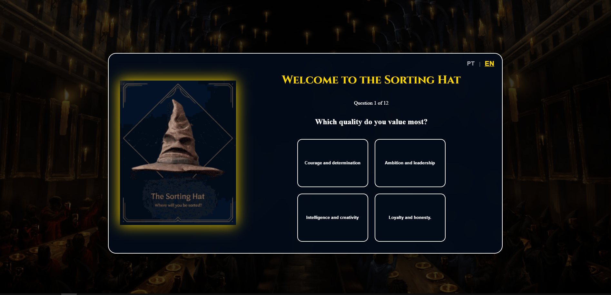
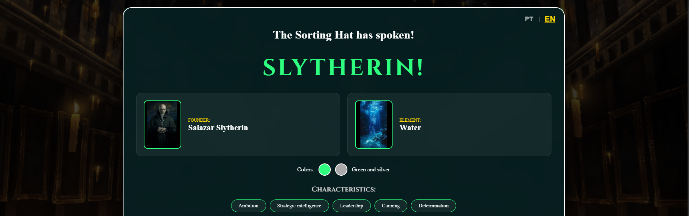
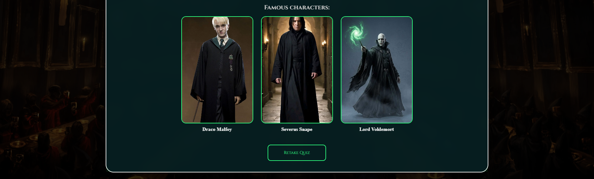

<div align="center">
  

  # ⚡ Hogwarts Sorting Hat Experience


  <p><strong>Step into the Wizarding World and discover your true Hogwarts House!</strong></p>

  [Explore the Demo](#-live-demo) • [Features](#-key-features) • [Tech Stack](#-built-with) • [Installation](#-how-to-run)
</div>

---

## 📖 About the Project

This is a fully immersive, multilingual React application. It features a cinematic introduction with video backgrounds and atmospheric music, leading the user through a magical quiz. Using a custom algorithm, the **Sorting Hat** analyzes your choices to assign you to Gryffindor, Slytherin, Ravenclaw, or Hufflepuff.

The project showcases advanced **React** concepts like:
- Complex state management for quiz scoring.
- Smooth UI transitions with **Framer Motion**.
- Dynamic internationalization (**i18next**) for Portuguese and English.

---

## ✨ Key Features

- 🎬 **Cinematic Intro:** Immersive video background with auto-playing atmospheric music.
- 🌍 **Multilingual:** Seamlessly switch between 🇧🇷 **PT-BR** and 🇺🇸 **EN-US**.
- 🧠 **Smart Quiz:** A dynamic questionnaire that calculates house points in real-time.
- 🎨 **Visual Reveal:** A high-impact result page with:
  - **Dynamic Theming:** UI colors change based on the sorted house.
  - **House Lore:** Displays founders, elements, and famous characters.
  - **Animated Cards:** Cascade animations for a magical feel.

---

## 🛠 Built With

| Tech | Purpose |
| :--- | :--- |
| **React 18** | Component-based UI architecture |
| **Framer Motion** | Complex entrance and exit animations |
| **i18next** | Global translation and localization |
| **React Router 6** | Navigation between Intro and Quiz |
| **CSS3** | Custom glassmorphism and wizarding aesthetics |

---

## 📸 Preview

  <p align="center">
    
    
    
    
  </p>

---

## 🚀 How to Run

1. **Clone the magic:**
   ```bash
   git clone https://github.com/seu-usuario/seu-repositorio.git
Enter the chamber:
code
Bash
cd seu-repositorio
Install the spells (dependencies):
code
Bash
npm install
Cast the server:
code
Bash
npm run dev
🧙 Character & House Logic
The application uses a specialized mapping system to link house results with their respective assets:
Gryffindor: Fire element, Bravery traits, and icons like Harry, Hermione, and Ron.
Slytherin: Water element, Ambition traits, and icons like Snape and Voldemort.
Ravenclaw: Air element, Wisdom traits, and icons like Luna and Cho.
Hufflepuff: Earth element, Loyalty traits, and icons like Cedric and Newt.
📜 Credits
Soundtrack: Harry Potter Theme Music.
Visuals: All images and videos are inspired by the Wizarding World of J.K. Rowling.
Developer: Seu Nome
<div align="center">
<br />
<sub>Built with ❤️ and Magic.</sub>
</div>

